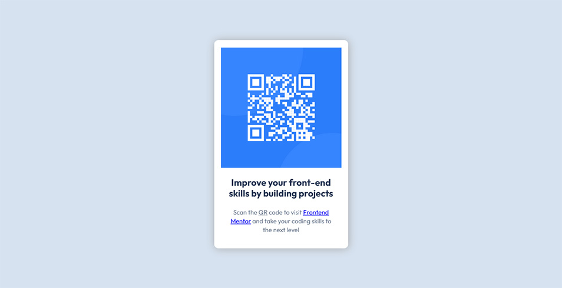
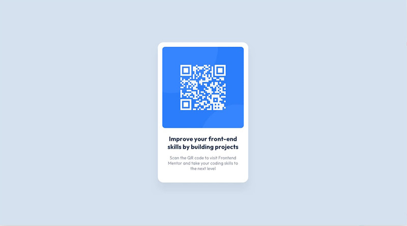

# Frontend Mentor - QR code component solution

This is a solution to
the [QR code component challenge on Frontend Mentor](https://www.frontendmentor.io/challenges/qr-code-component-iux_sIO_H).
Frontend Mentor challenges help you improve your coding skills by building realistic projects.

## Overview

This is my attempt at replicating the QR code component webpage.

### Screenshot

|                                      My Solution                                       |                     Goal                      |
|:--------------------------------------------------------------------------------------:|:---------------------------------------------:|
|  |  |

### Links

- [Submission Page](https://www.frontendmentor.io/solutions/responsive-qr-code-component-using-css-nesting-1LwV76ZD-A)
- [Live Site URL](https://blankztheather.github.io/qr-challenge/)
